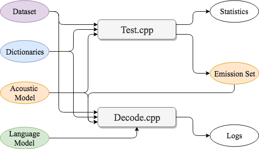

# Decoder


There are two components in decoding — test and decode.

* The test stage is to compute basic statistics like letter error rate (LER) and word error rate (WER) given an acoustic model using the greedy best path from the Viterbi algorithm. It will also generate an `Emission Set` including the emission matrix as well as other target-related information for each sample, so that the `Emission Set` can be fed into decoder directly to generate transcripts without running feed forward for raw wave inputs again.
* The decode stage focuses on minimizing the WER using a beam search decoder with a language model. It can take as input either an emission set generated from the test stage, which enables running hyper-parameter search in parallel, or an acoustic model to generate emissions at runtime, which may be more convenient when the dataset being decoded is small and a hyper-parameter sweep is not required.

Aside from dataset and acoustic model, we also need two dictionaries as input.

* Token dictionary: Same as the dictionary used to train the acoustic model and the order of tokens should also be identical. Each line in it is a unique token.
* Word dictionary: All the candidate words the decoder refers to. Each line in it is a pair of word and its spelling split by a tab space, and tokens in the spelling represented by a string each are split by space (e.g. `apple	a p p l e`).


### Building
```
buck build @mode/opt -c fbcode.platform=gcc-5-glibc-2.23 deeplearning/projects/wav2letter:test_cpp
buck build @mode/opt -c fbcode.platform=gcc-5-glibc-2.23 deeplearning/projects/wav2letter:decode_cpp
```

### Running the `Test`
Two dictionaries are specified through flags `tokens` and `lexicon`. We also have to set flag `am` and `emission_dir` to the path of the acoustic model and the directory where we want to save the emission set. Flags `datadir` and `test` are combined to specify the datasets we want to run experiment on. Note that we can test on more than 1 datasets, they have to be in the same `datadir` and are specified in `test` flag separated by a single comma in between.
```
<test_cpp_binary> \
-tokens <path/to/tokens.txt> \
-lexicon <path/to/words.txt> \
-am <path/to/acoustic_model.bin> \
-emission_dir <path/to/emission_dir/> \
-datadir <path/to/dataset/> \
-test <path/to/testset/> \
-maxload -1 \
-show
```

### Running the `Decode`
Decoder can take either an acoustic model or an emission set as input, but not both. So only one of the flags `am` and `emission_dir` should be set. In general, flags across Decode and Test have similar functions. All the hyper-parameters are self-documented and can be set accordingly. Flag `sclite` specifies the path to save the logs, including *stdout* log and hypothesis and references in *sclite* format ([trn]( http://www1.icsi.berkeley.edu/Speech/docs/sctk-1.2/infmts.htm#trn_fmt_name_0)).

#### Using acoustic model
```
<decode_cpp_binary> \
-tokens <path/to/tokens.txt> \
-lexicon <path/to/words.txt> \
-am <path/to/acoustic_model.bin> \
-lm <path/to/language_model.bin> \
-datadir <path/to/dataset/> \
-test <path/to/testset/> \
-sclite <path/to/save/logs/> \
-lmweight 4 \
-wordscore 2.2 \
-maxload 50 \
-beamsize 2500 \
-beamscore 100 \
-silweight -1 \
-nthread_decoder 8 \
-smearing max \
-show \
-showletters
```

#### Using emission set
```
<decode_cpp_binary> \
-tokens <path/to/tokens.txt> \
-lexicon <path/to/words.txt> \
-emission_dir <path/to/emission_dir/> \
-lm <path/to/language_model.bin> \
-datadir <path/to/dataset/> \
-test <path/to/testset/> \
-sclite <path/to/save/logs/> \
-lmweight 4 \
-wordscore 2.2 \
-maxload 50 \
-beamsize 2500 \
-beamscore 100 \
-silweight -1 \
-nthread_decoder 8 \
-smearing max \
-show \
-showletters
```
